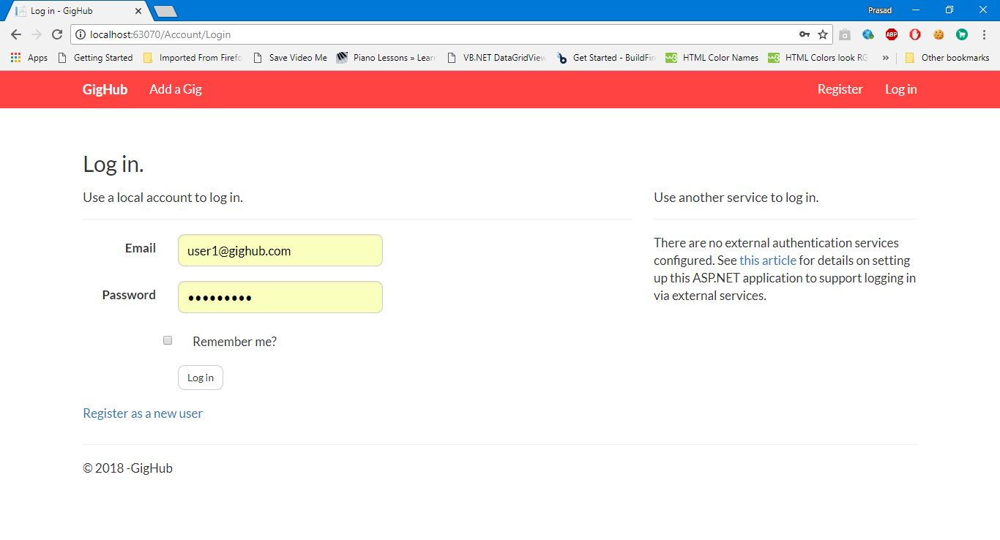

Technology Used: Asp.Net MVC 5, Entity Framework (MSSQL) 

• This is a social media website for Artists and their followers. 

• Artists can post their events with date, time and venue so it can be seen by the other users. 

• User can follow their favorite artists to stay updated for their upcoming events and 
  they will get notification if any artist post   or cancel the event. 

• Followers can see upcoming events and can update status of attending the event. 

